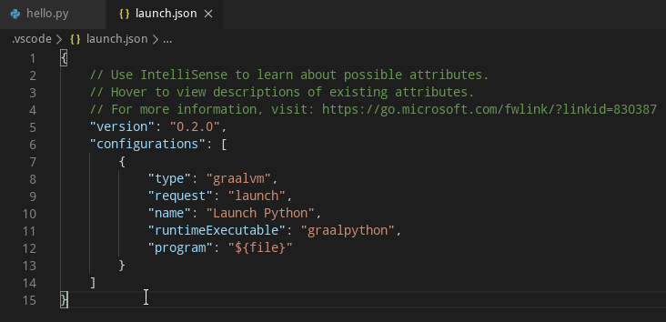
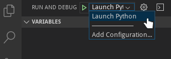

# GraalVM Python Support for VS Code

A VS Code extension providing the basic support for editing and debugging Python programs running on [GraalVM Python](http://www.graalvm.org/docs/reference-manual/languages/python).
The extension is Technology Preview.

## Features

### GraalVM Python Component Installation

Upon the extension installation, the GraalVM is checked for presence of the Python component and user is provided with an option of an automatic installation of the missing component.

The folowing command from the Command Palette (Ctrl+Shift+P) can be used to install the GraalVM Python component manually:
* __Install GraalVM Component__

### Python Debugging

To debug a Python application running on GraalVM, creating a launch configuration for the application is necessary. To do so, open the applicarion project folder in VS Code (File > Open Folder) and then select the Configure gear icon on the Debug view top bar. If debugging is not yet configured (no `launch.json` has been created), select `GraalVM` from the list of available debug environmnets. Once the `launch.json` file is opened in the editor, one of the following techniques can be used to add a new configuration:
* Use IntelliSense if your cursor is located inside the configurations array.
* Press the Add Configuration button to invoke snippet IntelliSense at the start of the array.
* Choose Add Configuration option in the Debug menu.

The GraalVM Pyton extension provides the following debug configuration that can be used to debug a Python applications/scripts running on GraalVM:
* __Launch Python Script__ - Launches a Python script using GraalVM in a debug mode.

When editing debug configurations, you can use IntelliSense suggestions (Ctrl+Space) to find out which attributes exist for a specific debug configuration. Hover help is also available for all attributes.

In order to start a debug session, first select the proper configuration using the Configuration drop-down in the Debug view. Once you have your launch configuration set, start your debug session with F5. Alternatively you can run your configuration through the Command Palette (Ctrl+Shift+P), by filtering on Debug: Select and Start Debugging or typing 'debug ', and selecting the configuration you want to debug.

### Additional Editor Features

Since an easy writing of [polyglot](https://www.graalvm.org/docs/reference-manual/polyglot) applications is one of the defining features of GraalVM, the code completion invoked inside Python sources provides items for `Polyglot.eval(...)`, `Polyglot.eval_file(...)` and `Java.type(...)` calls.

For Python sources opened in editor, all the `Polyglot.eval(...)` calls are detected and the respective embedded languages are injected to their locations. For example, having a JavaScript code snippet called via the Polyglot API from inside a Python source, the JavaScript language code is embedded inside the corresponding Python string and all VS Code's editing features (syntax highlighting, bracket matching, auto closing pairs, code completion, etc.) treat the content of the string as the JavaScript source code.

## Requirements

This extension depends on the following extensions:
* [Python](https://marketplace.visualstudio.com/items?itemName=ms-python.python) - Python language support.
* [GraalVM](https://marketplace.visualstudio.com/items?itemName=oracle-labs-graalvm.graalvm) - Basic support for GraalVM.

## Privacy Policy

Please read the [Oracle Privacy Policy](https://www.oracle.com/legal/privacy/privacy-policy.html) to learn more.
