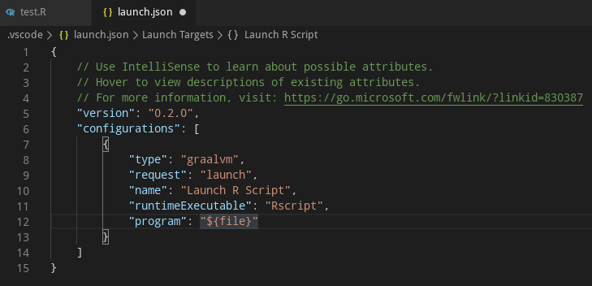
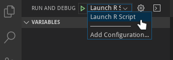

# GraalVM R Support for VS Code

A VS Code extension providing the basic support for editing and debugging R programs running on [GraalVM R](http://www.graalvm.org/docs/reference-manual/languages/r).
The extension is Technology Preview.

## Features

### GraalVM R Component Installation

Upon the extension installation, the GraalVM is checked for presence of the R component and user is provided with an option of an automatic installation of the missing component.

The following command from the Command Palette (Ctrl+Shift+P) can be used to install the GraalVM R component manually:
* __Install GraalVM Component__

### R Debugging

To debug an R application running on GraalVM, creating a launch configuration for the application is necessary. To do so, open the applicarion project folder in VS Code (File > Open Folder) and then select the Configure gear icon on the Debug view top bar. If debugging is not yet configured (no `launch.json` has been created), select `GraalVM` from the list of available debug environmnets. Once the `launch.json` file is opened in the editor, one of the following techniques can be used to add a new configuration:
* Use IntelliSense if your cursor is located inside the configurations array.
* Press the Add Configuration button to invoke snippet IntelliSense at the start of the array.
* Choose Add Configuration option in the Debug menu.

The GraalVM R extension provides the following debug configurations that can be used to debug an R applications/scripts running on GraalVM:
* __Launch R Script__ - Launches an R script using GraalVM in a debug mode.
* __Launch R Terminal__ - Launches an integrated R terminal running on GraalVM in a debug mode.

When editing debug configurations, you can use IntelliSense suggestions (Ctrl+Space) to find out which attributes exist for a specific debug configuration. Hover help is also available for all attributes.

In order to start a debug session, first select the proper configuration using the Configuration drop-down in the Debug view. Once you have your launch configuration set, start your debug session with F5. Alternatively you can run your configuration through the Command Palette (Ctrl+Shift+P), by filtering on Debug: Select and Start Debugging or typing 'debug ', and selecting the configuration you want to debug.

### Language Server Integration

GraalVM supports smart editing features of development tools used to create guest language applications by providing a built-in implementation of the [Language Server Protocol](https://microsoft.github.io/language-server-protocol). This allows you to attach compatible development tools such as VS Code to GraalVM and to get features like auto complete, go to declaration, or documentation on hover.

Note that the GraalVM Language Server itself does not provide the static data usually gathered by parsing the application sources (as these data are sometimes fuzzy in case of dynamic languages). Instead, the GraalVM Language Server was designed to provide the accurate dynamic data gathered form the application runtime. However, the GraalVM Language Server could delegate to the existing language servers written specially for the particular languages and merge the static data returned from these servers with its own dynamic data to a single result.

This extension provides an option to automatically install and run the [languageserver](https://github.com/REditorSupport/languageserver) which is an implementation of the Language Server Protocol for the language of R. Enabling this option, the GraalVM R installation is checked for presence of the `languageserver` package and user is provided with an option of an automatic installation of the missing package.

Once the `languageserver` package is installed, the R Language Server is automatically started and passed to the GraalVM Language Server as delegate when necessary.

### Additional Editor Features

Since an easy writing of [polyglot](https://www.graalvm.org/docs/reference-manual/polyglot) applications is one of the defining features of GraalVM, the code completion invoked inside R sources provides items for `eval.polyglot(...)` and `new("<Java type>", ...)` calls.

For R sources opened in editor, all the `eval.polyglot(...)` calls are detected and the respective embedded languages are injected to their locations. For example, having a JavaScript code snippet called via the Polyglot API from inside an R source, the JavaScript language code is embedded inside the corresponding R string and all VS Code's editing features (syntax highlighting, bracket matching, auto closing pairs, code completion, etc.) treat the content of the string as the JavaScript source code.

## Extension Settings

This extension contributes the following settings:

* __graalvm.languageServer.startRLanguageServer__ - Start R Language Server.

## Requirements

This extension depends on the following extensions:
* [R](https://marketplace.visualstudio.com/items?itemName=Ikuyadeu.r) - Basic support for R language.
* [GraalVM](https://marketplace.visualstudio.com/items?itemName=oracle-labs-graalvm.graalvm) - Basic support for GraalVM.

## Privacy Policy

Please read the [Oracle Privacy Policy](https://www.oracle.com/legal/privacy/privacy-policy.html) to learn more.
